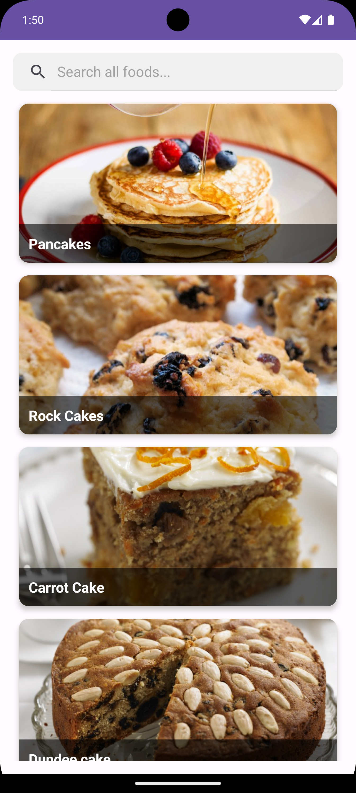
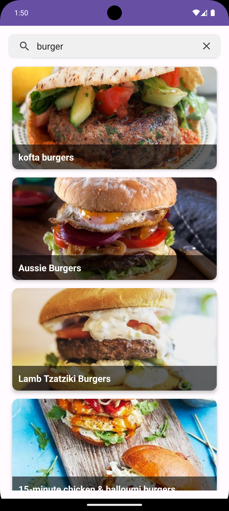
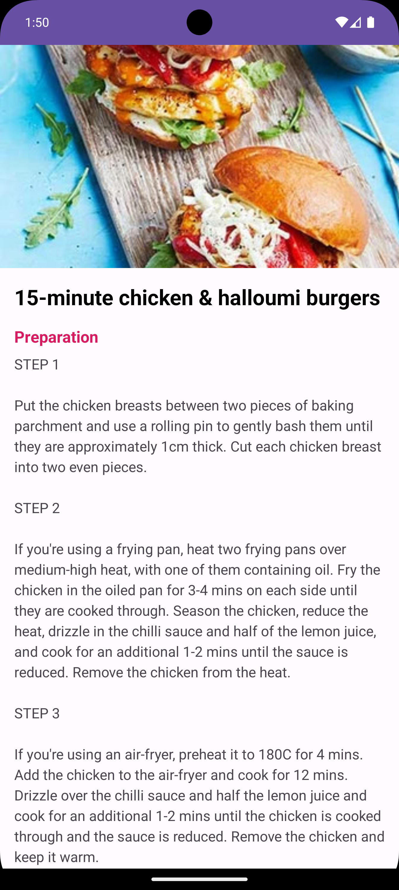
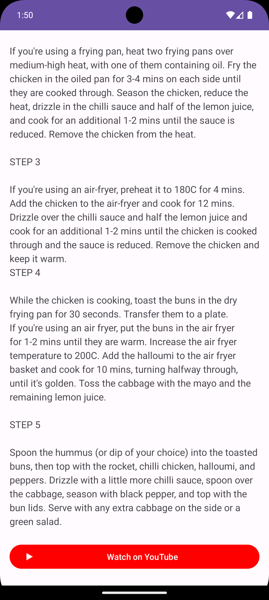

# Foodie - Yemek Tarifi Uygulaması 🍔

  

**Foodie**, kullanıcıların binlerce yemek tarifi arasında arama yapabildiği, detaylı malzeme listesini ve hazırlanış adımlarını görüntüleyebildiği modern bir Android uygulamasıdır. **TheMealDB API** kullanılarak geliştirilmiştir.

## 📱 Ekran Görüntüleri

<p align="center">
  
  
  
  
</p>

## 🛠️ Kullanılan Teknolojiler ve Kütüphaneler

Bu projede **Modern Android Geliştirme (MAD)** prensiplerine sadık kalınmıştır:

* **[Kotlin](https://kotlinlang.org/):** %100 Kotlin dili ile yazıldı.
* **MVVM (Model-View-ViewModel):** UI ve İş mantığını birbirinden ayırmak için mimari desen olarak kullanıldı.
* **[Retrofit](https://square.github.io/retrofit/):** REST API istekleri ve ağ yönetimi için.
* **[Coroutines](https://kotlinlang.org/docs/coroutines-overview.html):** Asenkron işlemler ve arka plan iş parçacığı yönetimi için.
* **[Coil](https://coil-kt.github.io/coil/):** Hızlı ve performanslı resim yükleme işlemleri için.
* **LiveData & ViewModel:** Veri akışını yönetmek ve ekran döndürme (configuration changes) durumlarını handle etmek için.
* **RecyclerView & CardView:** Listeleme ve modern arayüz tasarımı için.
* **Parcelable:** Activity'ler arası güvenli veri taşıma için.

## 🚀 Özellikler

* 🔍 **Dinamik Arama:** Kullanıcılar anlık olarak API üzerinden yemek araması yapabilir.
* 📋 **Liste Görünümü:** Arama sonuçları şık kartlar (CardView) halinde listelenir.
* 📖 **Detay Sayfası:** Seçilen yemeğin tarifi, malzemeleri ve görseli detaylıca gösterilir.
* 🎥 **Youtube Entegrasyonu:** Tarifin yapılış videosuna tek tuşla yönlendirme yapılır.
* ⚡ **Hata Yönetimi:** İnternet yavaşlığında veya veri olmadığında kullanıcıya uygun geri bildirimler (Loading bar vb.) verilir.

## 📂 Proje Mimarisi

Proje, temiz kod (Clean Code) prensiplerine uygun olarak **Katmanlı Mimari** yapısındadır:

```text
com.berkar.foodie
├── data            # Veri Katmanı
│   ├── api         # Retrofit Interface ve Instance
│   ├── model       # API Response Data Class'ları
│   └── repository  # Veri kaynağı yönetimi
│
├── ui              # Arayüz Katmanı
│   ├── adapter     # RecyclerView Adapter
│   ├── view        # Activity'ler (MainActivity, DetailActivity)
│   └── viewmodel   # State yönetimi ve Logic (MealViewModel)
│
└── util            # Yardımcı sınıflar ve Extension'lar
```

## 🛠️ Kurulum

Projeyi yerel makinenizde çalıştırmak için:

1.  Repoyu klonlayın:
    ```bash
    git clone https://github.com/berk-ar/Foodie.git
    ```
2.  Android Studio'da projeyi açın.
3.  Gradle senkronizasyonunun bitmesini bekleyin.
4.  Uygulamayı emülatörde veya fiziksel cihazda çalıştırın.
